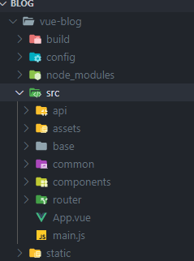
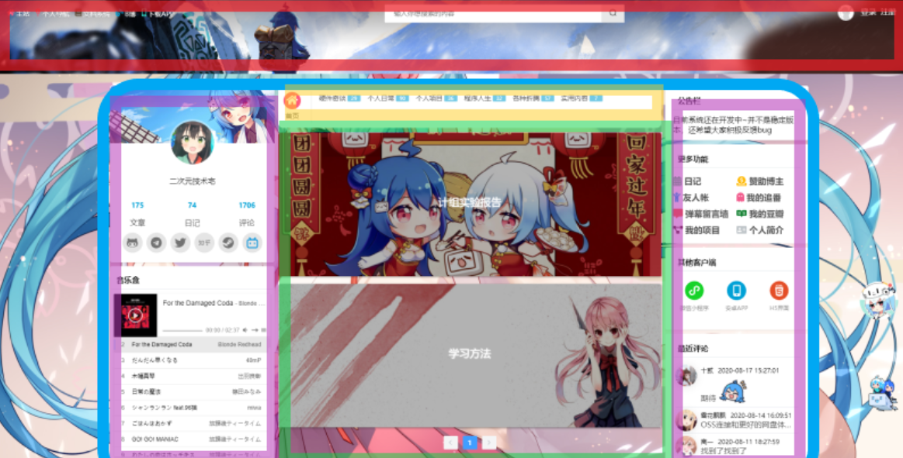
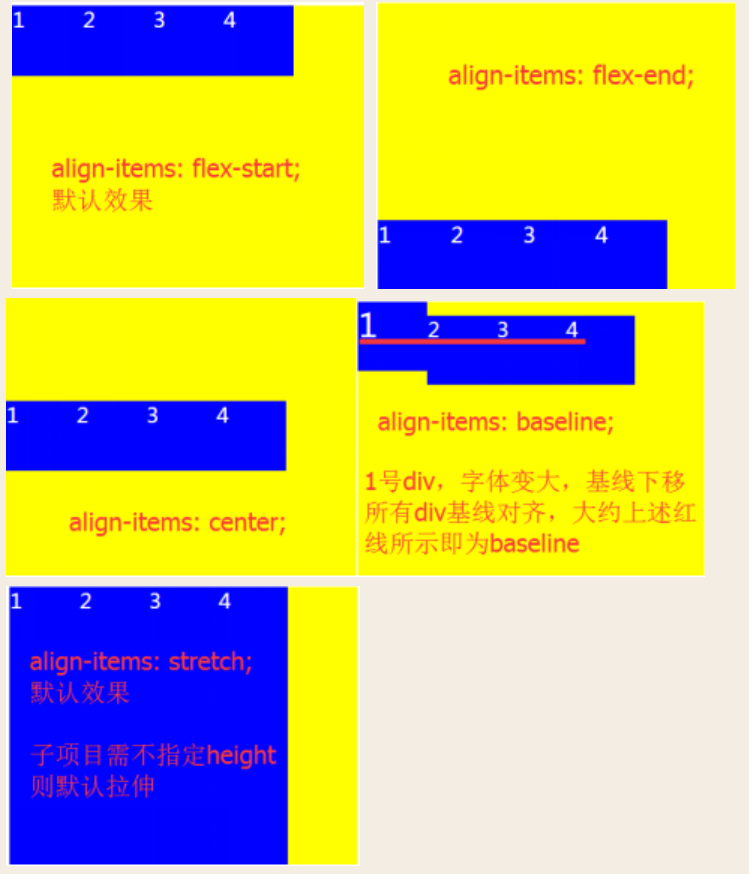
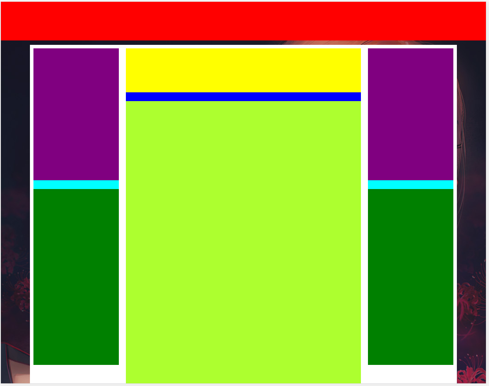
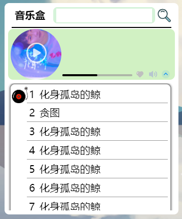
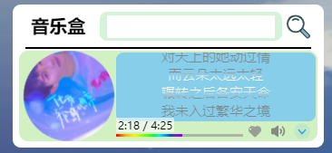
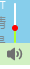
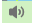
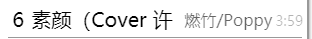
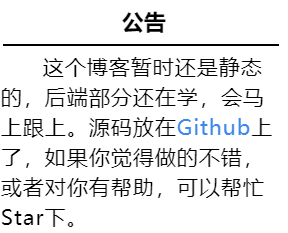

# 							博客主页开发日志

>## 0. 开篇
>
>今天818，帮弟弟买手机又被狗东坑了一手，真是气啊。言归正传，这是第一篇markdown博客，主要目的呢，是为了熟悉下markdown语法和记录下博客的开发日志，也是第一次边学边做笔记，当初没用现成的wordpress和hexo，就是为了自己实现一下动态博客。开始吧～
>
>GitHub地址在此：https://github.com/iCodek/vue-blog

# 1.网站大体样式

## 1.1 先创建Vue项目

```
vue init webpack vue-blog
```

改下结构，加了下面三个目录



- api 前后端交互
- base 基本组件
- common 用到的css,js方法


## 1.2 编写样式

主要样子呢 打算照着[小游的博客主页](https://xiaoyou66.com/)画瓢



观察了下，路由的位置都在中间的绿色区域，那就先把其他的组件位置固定下。

# 2.各种组件

## 2.1 m-header组件

创建好了脚手架，突然发现body默认是*margin:* *8px;*晕，在index.html修改下style

search-box组件用到了icon-font 使用方式是在style中导入（全局可用）忽略了scope

```js
@import url("../../common/css/iconfont/iconfont.css");
```

分类标题用的弹性布局，也是第一次搞懂了，只要设置父元素display: flex; 在设置子元素的flex大小，是成比例缩放的。其他参数可以[参见](https://www.runoob.com/w3cnote/flex-grammar.html)。

还有首页的居中，设置父元素没有高度，然后子元素设置margin即可。

------

分割线表示第二天，做了挺多的，主要是遇到了好多坑，来总结一下

上面的icon导入方式是黑白的图标，换了一种svg的方式，首先把iconfont的图标加入自己的项目，然后生成自己的代码，例如

```
//at.alicdn.com/t/font_2014472_qa5ruvao5kb.js
```

然后在index.html引入

```html
<script src="//at.alicdn.com/t/font_2014472_qa5ruvao5kb.js"></script>
```

然后就不用像上面import了，直接

```html
<svg class="icon" aria-hidden="true" @click='toggleSearchBox()' @mouseenter="showSearchBox()">
   <use xlink:href="#icon-sousuo"></use>
</svg>
```

就能用了，#后面是图标的代码（自己项目里的）

## 2.2  content组件

中间主要有三列，用了弹性布局

父级元素 

```css
    <left-content></left-content>
    <center-content></center-content>
    <right-content></right-content>
```

样式

```css
  display: flex;
```

再把中间的元素设置样式

```css
  flex: 1;
```

另外 为了适配移动端，左右两边当宽度小于500不显示，响应式css代码

```css
  @media screen and (max-width:500px){
    display: none;
  }
```

默认左右两边的容器直接撑到底下了，查了下父元素要设置**align-items**



大致框架为



## 2.3 user-info组件

这里的布局都是用的flex，熟能生巧了。

主要难（坑）点

- 头像要设置hover时变大，那只能是absolute定位，所以在头像div外面套了一个relative定位的div，在把里面的头像div弄成absolute。这样变大也不会影像下面的元素位置。绝对定位想要居中得用left top 50%和transform: translate(-50%, -50%)

- 头像hover旋转要注意transition里是all，居中定位的transform: translate(-50%, -50%)要保留，所以hover里是transform: translate(-50%, -50%) rotate(360deg); 注意这里还有顺序要求，不然就不转了（不知道为什么）

  ```css
  .userheadwrap {
      position: relative;
      .userhead {
      left: 50%;
      position: absolute;
      width: 90px;
      height: 90px;
      border-radius: 100%;
      border: 4px solid hsla(0,0%,100%,.4);
      background-color: red;
      background: url('../../assets/siyecao1.jpg') center center no-repeat;
      background-size: cover;
      transition: all 0.4s;
      transform: translate(-50%, -50%);
      &:hover {
        width: 120px;
        height: 120px;
        transform: translate(-50%, -50%) rotate(360deg);
      }
    }
  }
  ```

- 下面的联系方式图标想要一个hover显示提示框的效果这里要用三个伪类，首先在after伪类里面弄好圆角框和动画时间，然后隐藏。接下来在:hover::after里面显示就可以了，下面的三角形其实是一个css画的before

  ```css
  ::after {
  content: attr(data-title);    //取到data-title属性的值
  background:#000;
  width: 80px;
  height: 35px;
  line-height: 35px;
  border-radius: 10px;
  font-size: 16px;
  color: #fff;
  position: absolute;
  bottom: 58px;
  left: 0px;
  transition: all 0.4s;
  opacity: 0;
  }
  ```

  ```css
  :hover::after {
  opacity: 1;
  }
  ```

  ```css
  :before {				//三角形
  content: "";
  position: absolute;
  bottom: 50px;
  left: 34px;
  width: 0;
  height: 0;
  border-top: 8px solid #000;
  border-left: 6px solid transparent;
  border-right: 6px solid transparent;
  transition: all 0.4s;
  opacity: 0;
  }
  :hover::before{
  opacity: 1;
  }
  ```

## 2.4 music-box组件

这绝对称得上博客页面最难的地方，用上了keyframes动画，height是auto的动画，vuescroll插件，自己画svg，父子组件通信，Promise.all的使用，li里的span不换行，一个一个讲。



- keyframes 实现旋转动画，首先定义rotate

  ```css
    @keyframes rotate {
      0% {
        transform: rotate(0);
      }
      100% {
        transform: rotate(360deg);
      }
    }
  ```

  再在css里定义animation

  ```css
  &.play {
  animation: rotate 10s linear infinite;
  }
  &.pause {
  animation-play-state: paused;
  }
  ```

  即可实现封面无限旋转
  
- height是auto不固定的div无法实现height动画，可以利用max-height

  ```css
  .scrollboxhide {
  max-height: 0 !important;
  margin-bottom: 0px !important;
  }
  .scrollbox {
  max-height: 250px;
  margin-bottom: 8px;
  transition: all 0.5s;
  }
  ```
  
- vuescroll插件使用，现在main.js里

  ```js
  import vuescroll from 'vuescroll'
  Vue.use(vuescroll)
  
  Vue.prototype.$vuescrollConfig = {
    vuescroll: {
      mode: 'native', // 选择一个模式, native 或者 slide(pc&app)
      sizeStrategy: 'percent', // 如果父容器不是固定高度，请设置为 number , 否则保持默认的percent即可
      detectResize: true // 是否检测内容尺寸发生变化
    },
    scrollPanel: {
      initialScrollY: false, // 只要组件mounted之后自动滚动的距离。 例如 100 or 10%
      initialScrollX: false,
      scrollingX: false, // 是否启用 x 或者 y 方向上的滚动
      scrollingY: true,
      speed: 100, // 多长时间内完成一次滚动。 数值越小滚动的速度越快
      easing: undefined, // 滚动动画 参数通animation
      verticalNativeBarPos: 'right'// 原生滚动条的位置
    },
    rail: { // 轨道
      background: '#c3c3c3', // 轨道的背景色
      opacity: 0,
      size: '6px',
      specifyBorderRadius: false, // 是否指定轨道的 borderRadius， 如果不那么将会自动设置
      gutterOfEnds: null,
      gutterOfSide: '0px', // 轨道距 x 和 y 轴两端的距离
      keepShow: false // 是否即使 bar 不存在的情况下也保持显示
    },
    bar: {
      showDelay: 1000, // 在鼠标离开容器后多长时间隐藏滚动条
      onlyShowBarOnScroll: false, //  当页面滚动时显示
      keepShow: false, // 是否一直显示
      background: '#c3c3c3',
      opacity: 1,
      hoverStyle: false,
      specifyBorderRadius: false,
      minSize: false,
      size: '6px',
      disable: false // 是否禁用滚动条
    }, // 在这里设置全局默认配置
    name: 'vuescroll' // 在这里自定义组件名字，默认是vueScroll
  }
  ```

  然后使用

  ```js
  <div :class="scrollClass">
    <vue-scroll>
      <div>
        <ul class="songlist">
          <li class="song" v-for="(song, index) in songlist" :key="index" @click="toPlay(song,$event)" ref="li">
            <svg :class="iconClass" aria-hidden="true" v-if="index==playindex">
            	<use xlink:href="#icon-cp-copy-copy"></use>
            </svg>
            <svg :class="iconClass" aria-hidden="true" v-if="index==playindex">
            	<use xlink:href="#icon-yinle"></use>
            </svg>
            <span>
            	<span class="index">{{index + 1}}</span>
            	<span class="name">{{song.name}}</span>
            </span>
            <div class="line"></div>
          </li>
        </ul>
      </div>
    </vue-scroll>
  </div>
  ```

- svg可以在iconfont自己下个差不多的，再上svg在线编辑网站改下就好了，覆盖掉原来自己项目里的svg

- 父子组件通信

  父调用子：

  父中组件

  ```js
  <player :playlist='songlist' v-if="songlist.length" ref='player' @setIcon='setIcon' @play='play' @callshouqi="shouqilist" @callzhankai="zhankailist"></player>
  ```

  调用

  ```js
  toPlay (item, e) {
  	this.$refs.player.setPlay(item)
  }
  ```

  子调用父：

  子中调用

  ```js
  shouqi (e) {
    this.spread = false
    this.$emit('callshouqi')
  }
  ```

  父亲中用到的组件用@callshouqi="shouqilist"

  ```js
  <player :playlist='songlist' v-if="songlist.length" ref='player' @setIcon='setIcon' @play='play' @callshouqi="shouqilist" @callzhankai="zhankailist"></player>
  ```

  父中函数

  ```js
  shouqilist () {
    this.spread = false
    this.scrollClass = 'scrollbox scrollboxhide'
  }
  ```

- Promise.all

  在处理for中的异步方法中，每个异步方法都有then，相当于两个异步，必须等所有异步执行完再赋值songlist

  ```js
  _getSongList () {
    const songlist = []
    const pros = []
    this.songs.forEach((id, index) => {
    	pros.push(getSongDetail(id).then((res) => {
        if (res.status === ERR_OK) {
          songlist.push({'id': res.data.songs[0].id, 'name': res.data.songs[0].name, 'pic': res.data.songs[0].al.picUrl, 'index': index})  
        }
    	}))
    })
    Promise.all(pros).then(() => {
    	songlist.sort((a, b) => a.index - b.index)
    	this.songlist = songlist
    })
  }
  ```

  Promise.all([p1,p2,...])接受Promise列表的传入参数，所以先创建一个for训练里面的异步列表，再传入Promise.all

- li里的span不换行

  ```html
  <li class="song" v-for="(song, index) in songlist" :key="index" @click="toPlay(song,$event)" ref="li">
    <span>
      <span class="index">{{index + 1}}</span>
      <span class="name">{{song.name}}</span>
    </span>
  </li>
  ```

  外面再套一个span，设置 white-space: nowrap; 和设置 li    overflow: hidden;

播放组件做了做了一天半，效果如图



真是苦难重重啊。

- 布局

  绿色整块display:flex; 图像大小固定，图片右边整块flex：1，然后也是flex布局，列向排列，主要是为了随着底部部分变化，歌词都可以撑满蓝色的区域，底部（进度条+图标）也是flex布局，进度条flex：1，可以随着屏幕变化而变。

- 播放进度条（注意点：document的事件绑定document.onmousemove = function() {} 可以用docume.onmousemove =null**清空绑定**

  但是使用document.addEventListener('mousemove',f)绑定的要用document.removeEventListener('mousemove',f）**解除该绑定**

  - 点击事件

    ```js
    progressClick (e) {
      let rect = this.$refs.progressBar.getBoundingClientRect()
      let offsetWidth = this._isMobile() ? e.touches[0].clientX - rect.left : e.clientX - rect.left //手机和电脑clientX不一样
      let barWidth = rect.right - rect.left
      let percent = offsetWidth / barWidth
      this.currentTime = this.duration * percent
      this.$refs.audio.currentTime = this.duration * percent
    }
    ```

  - pc端+移动端拖动事件

    ```js
    progressTouchStart (e) {
      this.touch.move = true
      let rect = this.$refs.progressBar.getBoundingClientRect()
      let barWidth = rect.right - rect.left
      let offsetWidth = this._isMobile() ? e.touches[0].clientX - rect.left : e.clientX - rect.left
      let percent = offsetWidth / barWidth
      if (this._isMobile()) {     //手机端触碰直接跳到进度
        this.currentTime = this.duration * percent
        this.$refs.audio.currentTime = this.duration * percent
      }
      this.touch.rect = rect    //PC端保存以下dom偏离位置
      let $this = this
      if (!this._isMobile()) {		//PC端和手机端的鼠标移动事件和鼠标按起事件不一样
        document.onmousemove = function (e) {
          $this.progressTouchMove(e)
        }
        document.onmouseup = function (e) {
          document.onmousemove = null
          document.onmouseup = null
          $this.progressTouchEnd(e)
        }
      } else {
        document.ontouchmove = function (e) {
          $this.progressTouchMove(e)
        }
        document.ontouchend = function (e) {
          document.ontouchmove = null
          document.ontouchend = null
          $this.progressTouchEnd(e)
        }
      }
    },
      progressTouchMove (e) {
        if (!this.touch.move) {
          return
        }
        let endX = this._isMobile() ? e.touches[0].clientX : e.clientX
        let percent = (endX - this.touch.rect.left) / (this.touch.rect.right - this.touch.rect.left)
        this.currentTime = this.duration * Math.min(Math.max(0, percent), 1)		//移一次设置一次进度条但是不改变事件
      },
        progressTouchEnd (e) {
          this.touch.move = false
          this.$refs.audio.currentTime = this.currentTime			//移完了改变播放时间
        }
    ```

- 歌词移动

  歌词没有点击事件，比上面简单一点

  ```js
  	lyricTouchStart (e) {
        this.songLyric.move = true
        this.songLyric.startY = this._isMobile() ? e.touches[0].clientY : e.clientY
        this.songLyric.marginTop = this.$refs.ul.style.marginTop
        let dom = document.querySelector('ul')
        let height = window.getComputedStyle(dom).height
        this.songLyric.height = height
        let $this = this
        if (!this._isMobile()) {
          document.onmousemove = function (e) {
            $this.lyricTouchMove(e)
          }
          document.onmouseup = function (e) {
            document.onmousemove = null
            document.onmouseup = null
            $this.lyricTouchEnd()
          }
        } else {
          document.ontouchmove = function (e) {
            $this.lyricTouchMove(e)
          }
          document.ontouchend = function (e) {
            document.ontouchmove = null
            document.ontouchend = null
            $this.lyricTouchEnd()
          }
        }
      },
      lyricTouchMove (e) {
        if (!this.songLyric.move) return
        let endY = this._isMobile() ? e.touches[0].clientY : e.clientY
        this.transitionOn = false
        let top = Math.min(parseInt(this.songLyric.marginTop) + endY - this.songLyric.startY, 25)
        let bottom = Math.max(-parseInt(this.songLyric.height) + 45, top)
        this.$refs.ul.style.marginTop = bottom + 'px'
      },
      lyricTouchEnd (e) {
        this.songLyric.move = false
        this.transitionOn = true
      }
  ```

- 音量悬浮显示音量bar

- 注意点：悬浮显示需要在鼠标悬浮在和进度条部分都要显示，所以干脆把这两个放在一个div里，初始父div位置就在图标上，hover时，把子div就是bar的height高度还原正常，这样鼠标移动到bar就可以继续hover显示

  ```css
  .volume {
    position: relative;
    display: inline-block;
    height: 30px;
    &:hover > .volume_wrap {
    height: 54px;
   	}
  }
  ```

  音量调整条 比上面两个简单

  ```js
  	volumeClick (e) {
        let rect = this.$refs.vlmpgs.getBoundingClientRect()
        let offsetHeight = rect.bottom - e.clientY
        let barHeight = rect.bottom - rect.top
        this.volume = Math.min(Math.max(offsetHeight / barHeight, 0), 1)
      },
      volumeMoveStart (e) {
        let rect = this.$refs.vlmpgs.getBoundingClientRect()
        let $this = this
        document.onmousemove = function (e) {
          let offsetHeight = rect.bottom - e.clientY
          let barHeight = rect.bottom - rect.top
  
          $this.volume = Math.min(Math.max(offsetHeight / barHeight, 0), 1)
        }
        document.onmouseup = function (e) {
          document.onmousemove = null
          document.onmouseup = null
        }
      }
  ```

  

- 歌词高亮

  使用了background-clip，思路绝对定位（ul会动）一个div，ul放在这个div里面，设置div css

  ```css
  .mask {
    position: absolute;
    width: 100%;
    height: 100%;
    color: transparent;
    -webkit-background-clip: text;
    background-image: linear-gradient(0deg, rgba(121, 121, 121, 0.8) 33%, white 45%, white 64%, rgba(121, 121, 121, 0.8) 72%);;
  }
  ```

  相当于歌词透明，背景是，背景透过透明的字就是-webkit-background-clip: text;的效果

- 获取内联样式

  ```js
  this.$refs.ul.style.marginTop
  ```

- 获取即时样式

  ```js
  let dom = document.querySelector('ul')
  let height = window.getComputedStyle(dom).height
  ```

- 事件e的位置

  #### 一、clientX、clientY

  点击位置距离当前body可视区域的x，y坐标

  #### 二、pageX、pageY

  对于整个页面来说，包括了被卷去的body部分的长度

  #### 三、screenX、screenY

  点击位置距离当前电脑屏幕的x，y坐标

  #### 四、offsetX、offsetY

  相对于带有定位的父盒子的x，y坐标

  #### 五、x、y

  和screenX、screenY一样

音乐盒又细化了两天 现在来继续总结下

加了搜索功能，花功夫主要在一些逻辑bug和动画上

- 输入框停止输入300毫秒后搜索，用到了截流函数

  ```js
  // 截流函数
  export function debounce (func, delay) {
    let timer
    return function (...args) {
      if (timer) {
        clearTimeout(timer)
      }
      timer = setTimeout(() => {
        func.apply(this, args)
      }, delay)
    }
  }
  ```

  然后在mounted方法中绑定watch调用的函数

  ```js
    mounted () {
      this.$watch('query', debounce((newQuery) => {
        if (newQuery) {
          let searchResults = []
          getSearchSongs(newQuery, 0).then((res) => {
            if (res.status === ERR_OK) {
              let songs = res.data.result.songs
              if (songs.length > 0) {
                songs.forEach((song, index) => {
                  searchResults.push({'id': song.id, 'name': song.name, 'pic': undefined, 'index': index, 'duration': song.duration, 'singerName': this.singerName(song.artists), 'source': 'Search', 'islike': false})
                })
                this.searchResults = searchResults
              }
            }
          })
        }
      }, 300))
    }
  ```

- 注意下.className:hover（无空格）和.className :hover（:前面有空格）的区别

- 列表布局

  注意歌名过长会隐藏掉，然后歌手名字长度是不固定的，局部方式

  ```css
  	.wrap {
    // white-space: nowrap;
    width: 300px;
    overflow: hidden;
    display: flex;
    height: 36px;
    .index {
      text-align: center;
      width: 26px;
    }
    .name {
      flex: 1;
    }
    .singer {
      float: right;
      font-size: 16px;
      opacity: 0.6;
      line-height: 36px;
      margin: 1px;
    }
    .duration {
      float: right;
      margin: 2px;
      width: 28px;
      font-size: 14px;
      opacity: 0.3;
    }
  ```

- 播放器组件用了很多vue动画，[参考](https://cn.vuejs.org/v2/guide/transitions.html#CSS-%E5%8A%A8%E7%94%BB)

- svg的title

  ```html
  <svg class="icon back" aria-hidden="true" v-show="isSearch" @click="searchReturn">
    <use xlink:href="#icon-romantic-music"></use>
    <title>我的歌单</title>
  </svg>
  ```

- 注册全局filter（main.js)

  ```js
  Vue.filter('format', (interval) => {
    interval = interval | 0
    let minute = interval / 60 | 0
    let second = interval % 60
    if (second < 10) {
      second = '0' + second
    }
    return minute + ':' + second
  })
  ```

- 递归深拷贝对象

  ```js
  export function copySong (obj) {
    if (typeof obj !== 'object') return obj
    let newobj = {}
    for (var attr in obj) {
      newobj[attr] = copySong(obj[attr])
    }
    return newobj
  }
  ```

- 图片src没有的时候，解决出现的边框

  ```css
  img[src=""],img:not([src]){
    opacity:0;
  }
  ```

- input里面的placeholder字体

  ```css
  input::-webkit-input-placeholder { 
  color: #ccc; 
  }
  ```

## 2.5 blog-box组件

- 背景图片API

  ```html
  <div class="pic" :style="{backgroundImage : 'url(https://random.52ecy.cn/randbg.php/'+index+')'}"></div>
  ```

  index是父组件传入的props，为了图片不重复（设置cookie达到不重复，第一次登录需要刷新）

#  3.骚操作

##  3.1 主题透明度

为了调节全局的透明的，使用拖拽进度条调节css的var() 

- 进度条组件

  ```css
  <template>
    <div class="sliderwrap">
      <div class="slider" ref="slider">
        <div class="process" :style="{width}"></div>
        <div class="thunk" ref="trunk" :style="{left}">
          <div :class="blockClass"></div>
          <div class="tips">
            <span>{{parseInt(scale*100)}}</span>
          </div>
        </div>
      </div>
    </div>
  </template>
  <script>
  /*
   * min 进度条最小值
   * max 进度条最大值
   * v-model 对当前值进行双向绑定实时显示拖拽进度
   * */
  export default {
    props: ['min', 'max', 'value'],
    data () {
      return {
        slider: null, // 滚动条DOM元素
        thunk: null, // 拖拽DOM元素
        per: this.value, // 当前值
        blockClass: 'block play'
      }
    },
    // 渲染到页面的时候
    mounted () {
      this.slider = this.$refs.slider
      this.thunk = this.$refs.trunk
      var _this = this
      this.thunk.onmousedown = function (e) {
        _this.blockClass = 'block'
        var width = parseInt(_this.width) / 100 * _this.slider.offsetWidth
        var disX = e.clientX
        document.onmousemove = function (e) {
          // value, left, width
          // 当value变化的时候，会通过计算属性修改left，width
          // 拖拽的时候获取的新width
          var newWidth = e.clientX - disX + width
          // 拖拽的时候得到新的百分比
          var scale = newWidth / _this.slider.offsetWidth
          _this.per = Math.ceil((_this.max - _this.min) * scale + _this.min)
          _this.per = Math.max(_this.per, _this.min)
          _this.per = Math.min(_this.per, _this.max)
          _this.$emit('input', _this.per)
        }
        document.onmouseup = function () {
          document.onmousemove = document.onmouseup = null
        }
        return false
      }
    },
    computed: {
      // 设置一个百分比，提供计算slider进度宽度和trunk的left值
      // 对应公式为  当前值-最小值/最大值-最小值 = slider进度width / slider总width
      // trunk left =  slider进度width + trunk宽度/2
      scale () {
        return (this.per - this.min) / (this.max - this.min)
      },
      width () {
        if (this.slider) {
          return 100 * this.scale + '%'
        } else {
          return 0 + '%'
        }
      },
      left () {
        if (this.slider) {
          return (
            parseInt(this.scale * 100) + '%'
          )
        } else {
          return 0 + '%'
        }
      }
    }
  }
  </script>
  <style>
  .sliderwrap {
    padding: 10px 5px 10px 5px;
    position: absolute;
  }
  .slider {
    position: relative;
    margin: 20px;
    width: 0;
    height: 10px;
    background: #e4e7ed;
    border-radius: 5px;
    cursor: pointer;
    transition: all 0.5s ease;
  }
  .sliderwrap:hover > .slider{
    width: 200px;
  }
  .sliderwrap:hover > .slider > .process{
    max-width: 200px;
  }
  .slider .process {
    position: absolute;
    left: 0;
    top: 0;
    max-width: 0;
    height: 10px;
    border-radius: 5px;
    background: #409eff;
    transition: max-width 0.5s ease;
  }
  .slider .thunk {
    position: absolute;
    margin-left: -10px;
    top: -7px;
    width: 20px;
    height: 20px;
  }
  .slider .block {
    width: 20px;
    height: 20px;
    border-radius: 50%;
    border: 2px solid #409eff;
    background: rgba(255, 255, 255, 1);
    transition: 0.2s all;
    opacity: 0.2;
  }
  .play {
    animation: twinkle 8s ease infinite;
  }
  .slider .tips {
    position: absolute;
    left: -7px;
    bottom: 30px;
    min-width: 15px;
    text-align: center;
    padding: 4px 8px;
    background: #000;
    border-radius: 5px;
    height: 24px;
    color: #fff;
    opacity: 0;
  }
  .sliderwrap:hover > .slider > .thunk >.block{
    opacity: 1 !important;
  }
  .slider .block:hover + .tips{
    opacity: 1;
  }
  @keyframes twinkle {
    0% {
      opacity: 0;
    }
    50% {
      opacity: 0.8;
    }
    100% {
      opacity: 0;
    }
  }
  </style>
  
  ```

  使用

  ```html
  <progress-bar :min=0 :max=100 v-model = "transparent"></progress-bar>
  ```

- 全局透明度，index.html定义

  ```css
  :root {
    --color: rgba(255, 255, 255, 1);
    --opacity: 1;
  }
  ```

  在需要改变的类样式中

  ```css
  background-color: var(--color);
  opacity: var(--opacity);
  ```

  观察进度条变化变化，调节透明度

  ```js
    watch: {
      transparent (newVal) {
        if (newVal >= 0 && newVal <= 100) {
          let root = document.querySelector(':root')
          let value = '--color: ' + 'rgba(255, 255, 255, ' + (1 - newVal / 100) + ');'
          let opacity = '--opacity: ' + (1 - newVal / 100)
          root.setAttribute('style', value + opacity)
        }
      }
    }
  ```

------

## 3.2 打乱动画

主要在这两部分有shuffle动画，参考了Vue官网。

- 引入shuffle函数（本来自己写的，结果动画不支持自己写的）

  ```js
  import _ from 'lodash/lodash'
  ```

- 创建彩虹色函数和打乱函数

  ```js
  methods: {
    rainBow () {
    	this.color = rainbowColor(this.tags.length, 15, 255)
    },
    shuffle () {
    	this.tags = _.shuffle(this.tags)
    }
  },
  ```

- 初始化颜色

  ```js
  mounted () {
  	this.rainBow()
  }
  ```

- 使用transition-group组件和绑定shuffle函数

  ```html
    <div  @click="shuffle">
      <transition-group name="cell" tag="div" class="tags">
        <div class="tag" v-for="(tag, index) in tags" :key="tag.number" :style="{backgroundColor : color[index]}">
          {{tag.name+' ('+tag.number+')'}}
        </div>
      </transition-group>
    </div>
  ```

- 添加css

  ```css
  .cell-move {
    transition: transform 1s;
  }
  ```

## 3.3 board组件



这是一个基础组件，预留了slot

```html
<template>
  <div class="board">
    <div class="title">
      {{title}}
    </div>
    <div class="line"></div>
    <slot></slot>
    <p v-html="content"></p>
  </div>
</template>
```

注意点：

```html
<p v-html="content"></p> 原本是<p>{{content}}</p>，
```

但是这样不支持content里面有换行，模板字符串也不行，只能用v-html，传入的

content需要使用

```
空格：&emsp;
换行：<br>
```

但是这样content不受组件内部css影响，需要在index.html的css设置

# 4.markdown显示

## 4.1 md-view组件

- package.json添加依赖dependencies

```json
"mavon-editor": "2.9.0",
"markdown-loader": "5.1.0",
"html-loader": "1.3.0"
```

- main.js全局注册

  ```js
  import mavonEditor from 'mavon-editor'
  import 'mavon-editor/dist/css/index.css'
  Vue.use(mavonEditor)
  ```

- 引入博客的md文件，并绑定给组件

  ```js
  import Blog from 'blogs/博客主页开发日志.md'
  export default {
    components: {},
    props: {},
    data () {
      return {
        value: Blog
      }
    },
    watch: {},
    computed: {
      _isMobile () {
        let flag = navigator.userAgent.match(/(phone|pad|pod|iPhone|iPod|ios|iPad|Android|Mobile|BlackBerry|IEMobile|MQQBrowser|JUC|Fennec|wOSBrowser|BrowserNG|WebOS|Symbian|Windows Phone)/i)
        return flag
      }
    },
    methods: {},
    created () {},
    mounted () {
      this.$refs.md.$nextTick(() => {
        setTimeout(() => {
          let blocks = this.$el.querySelectorAll('pre code')
          blocks.forEach((block) => hljs.highlightBlock(block))
        }, 1000)
      })
    }
  }
  ```

- 使用组件

  ```html
  <mavon-editor ref="md" v-model="value" :subfield='false' :editable='false' :toolbarsFlag='!_isMobile' :ishljs='true' defaultOpen="preview" :navigation='true'/>
  ```

# 5.保存喜欢的音乐

- 新建js/cache.js

  ```js
  import storage from 'good-storage'
  
  const FAVORITE_KEY = '__favorite__'
  const FAVORITE_MAX_LENGTH = 200
  
  function insertArray (arr, val, compare, maxLen) {
    const index = arr.findIndex(compare)
    if (index === 0) {
      return
    }
    if (index > 0) {
      arr.splice(index, 1)
    }
    arr.unshift(val)
    if (maxLen && arr.length > maxLen) {
      arr.pop()
    }
  }
  
  function deleteFromArray (arr, compare) {
    const index = arr.findIndex(compare)
    if (index > -1) {
      arr.splice(index, 1)
    }
  }
  
  export function saveFavorite (song) {
    let songs = storage.get(FAVORITE_KEY, [])
    insertArray(songs, song, (item) => {
      return song === item
    }, FAVORITE_MAX_LENGTH)
    storage.set(FAVORITE_KEY, songs)
    return songs
  }
  
  export function deleteFavorite (song) {
    let songs = storage.get(FAVORITE_KEY, [])
    deleteFromArray(songs, (item) => {
      return song.id === item.id
    })
    storage.set(FAVORITE_KEY, songs)
    return songs
  }
  
  export function loadFavorite () {
    return storage.get(FAVORITE_KEY, [])
  }
  ```

- 在music-box组件引入

  ```js
  import {saveFavorite, deleteFavorite, loadFavorite} from 'common/js/cache'
  ```

- 使用

  ```js
  like (item) {
    if (this.songs.includes(item.id)) return
    let copy = copySong(item)
    copy.source = 'Normal'
    copy.index = this.songs.length
    this.songs.push(copy.id)
    this.songlist.push(copy)
    this.playindex = copy.index
    saveFavorite(copy.id)
  },
  unlike (item) {
    let id = this.songs.indexOf(item.id)
    if (id !== -1) {
    this.songlist.splice(id, 1)
    this.songs.splice(id, 1)
    }
    this.playindex = -1
    this.songlist.forEach((item, index) => {
    item.index = index
    })
    deleteFavorite(item.id)
  },
  ```

# 6.代码高亮

- 添加依赖

  ```json
  "highlight.js": "10.1.2"
  ```

- md-view组件中引入

  ```js
  import hljs from 'highlight.js'
  ```

  设置props，（组件自带的高亮有点问题，强制关掉，但是codeStyle='atom-one-dark'是为了引入hljs的css样式

  ```js
  <mavon-editor ref="md" :ishljs='false' codeStyle='atom-one-dark'/>
  ```

- 加载后设置延时引入，在md-view的mounted方法添加

  ```js
  mounted () {
    this.$refs.md.$nextTick(() => {
      setTimeout(() => {
        let blocks = this.$el.querySelectorAll('pre code')
        blocks.forEach((block) => hljs.highlightBlock(block))
      }, 1000)
    })
  }
  ```
  
   this.$refs.md.$nextTick是在md组件渲染完成后执行，设置了延时是为了打开博客时不卡，因为是循环替换样式
  

注意

```css
  'rgba(0, 0, 0, calc(var(--opacity)*2))'
```

  是calc与var结合的写法

- 修改代码背景色和默认色

  ```css
  .markdown-body .highlight pre,
  .markdown-body pre {
    background-color: rgba(0, 0, 0, calc(var(--opacity)*2)) !important;
    color: #fff;
  }
  .v-note-wrapper, .v-note-op, .v-show-content{
    background-color: var(--color) !important;
  }
  .v-note-navigation-wrapper {
    right: 12px !important;
    bottom: auto !important;
    height: auto !important;
    border: none !important;
    width: 225px !important;
    background-color: rgba(255,255,255,0.4) !important;
    opacity: var(--opacity);
  }
  .v-show-content {
    height: 1200px !important;
  }
  .v-note-wrapper .v-note-panel .v-note-show .v-show-content.scroll-style-border-radius::-webkit-scrollbar, .v-note-wrapper .v-note-panel .v-note-show .v-show-content-html.scroll-style-border-radius::-webkit-scrollbar {
    width: 12px !important;
    background-color: var(--color) !important;
  }
  ```
  
